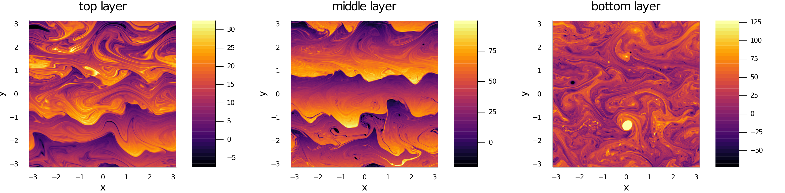

<!-- 
# Citations

Citations to entries in paper.bib should be in
[rMarkdown](http://rmarkdown.rstudio.com/authoring_bibliographies_and_citations.html)
format.

If you want to cite a software repository URL (e.g. something on GitHub without a preferred
citation) then you can do it with the example BibTeX entry below for @fidgit.

For a quick reference, the following citation commands can be used:
- `@author:2001`  ->  "Author et al. (2001)"
- `[@author:2001]` -> "(Author et al., 2001)"
- `[@author1:2001; @author2:2001]` -> "(Author1 et al., 2001; Author2 et al., 2002)"

Double dollars make self-standing equations:

$$\Theta(x) = \left\{\begin{array}{l}
0\textrm{ if } x < 0\cr
1\textrm{ else}
\end{array}\right.$$

You can also use plain \LaTeX for equations
\begin{equation}\label{eq:fourier}
\hat f(\omega) = \int_{-\infty}^{\infty} f(x) e^{i\omega x} dx
\end{equation}
and refer to \autoref{eq:fourier} from text.

# Figures

Figures can be included like this:

and referenced from text using \autoref{fig:example}.

-->

# Summary

`GeophysicalFlows.jl` is Julia package that gathers together a collections of pseudospectral 
solvers for geophysical fluid dynamics-related partial differetial equations on periodic 
domains. All modules use Fourier-based pseudospectral numerical methods and leverage the 
framework provided by the `FourierFlows.jl` Julia package for time-stepping, diagnostics, and 
output.

`GeophysicalFlows.jl` utilizes Julia's functionality and abstraction to enable all modules to
run on CPUs and GPUs. Selection of the architecture on which equations are solved is done by 
providing the argument `CPU()` or `GPU()` during constructing of a particular problem.

Figure 1: Snapshots from a nonlinearly equilibrated simulation of the Eady instability over a
meridional ridge. Simulation used `MultiLayerQG` module of `GeophysicalFlows.jl`. The Eady 
problem was approximated here using $5$ layers stacked up in the vertical. Each layer was 
simulated with $512 \times 512$ grid-points. Plots made with the `Plots.jl` Julia package 
which utilizes the `cmocean` colormaps [@Thyng2016].

A list of documented examples that appears in the package's documentation can familiar the user
and provide good stepping stones in building customized modules or examples. A community-based
collection of diagnostics throughout the modules are used to compute quantities like energy,
enstrophy, dissippation, etc.

The Python package `pyqg` [@pyqg] has similar functionality as GeophysicalFlows.jl. The major 
difference of `pyqg` and `GeophysicalFlows.jl` is that `pyqg` cannot run on GPUs. Dedalus [@Burns2020] 
is Python software with an intuitive script-based interface that uses spectral methods to solve
general partial differential equations, including the ones withing `GeophysicalFlows.jl`. Often 
also one can find isolated codes/scripts in personal websites or in open-source public repositories 
that have similar functionality as some of `GeophysicalFlows.jl`'s modules. 

# Acknowledgements

We acknowledge discussions with Keaton Burns, Cesar Rocha, and William Young. We would also 
like to take a moment to remember Sean R. Haney (February 1987-January 2021) who left us a 
bit too early.

# References
